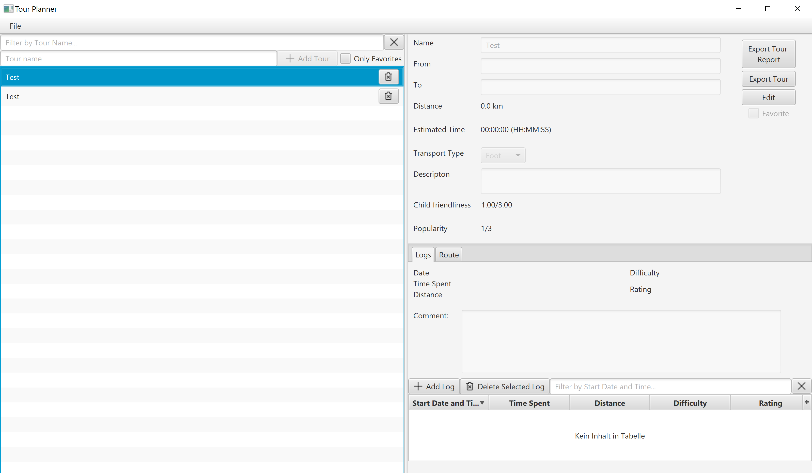
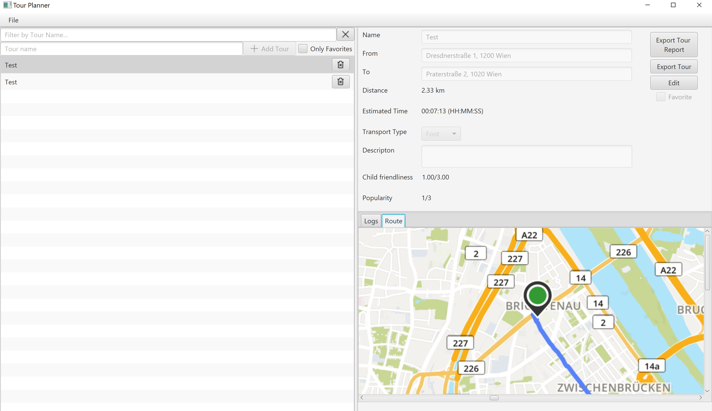
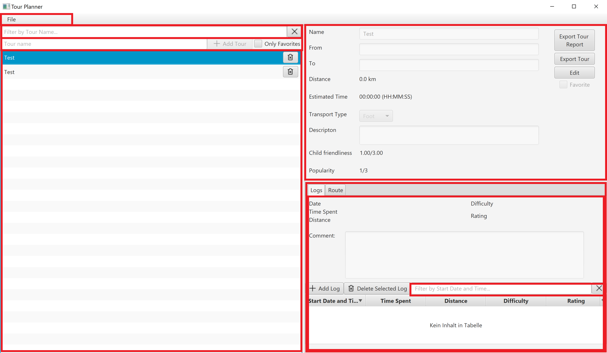
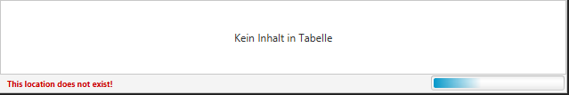

# Protocol

In the following document we are going to
document our implementation, thoughts and lesson of our project.

## Implementation

We started by dividing the app into two parts. The frontend and the backend. The frontend is a Javafx
application whereas the backend is a spring boot application with a postgres database running in the background.

### Frontend

#### Architecture

As mentioned above, we decided to create a REST-service with spring boot.
To communicate with this spring backend we created the `Service` class which is a
super class for all services (`TourSerivce`, `TourLogService`, `MapQuestService`). Every service has a concret
implementation called `...Impl` that implements all methods
and uses a the `retrofit` framework to call the BE. Each service has its own API interface with all the BE calls
specified.

- `TourService`:
    - This service handles all requests to the BE on `"tour/..."`
- `TourLogService`
    - This service handles all requests to the BE on `"tour-log/..."`
- `MapQuestService`
    - This service handles all requests to the BE on `"map/..."`

Do use these services we added microservices. These microservices are subclasses of the `javafx.concurrent.Service<V>`
class.
This is because all request should happen asynchronously not in the main JavaFX thread.

The microservices are either:

- Simple get (a `Supplier`)
- or Post (a `Function<T,R>`)

Each microservice needs a supplier or a function and a parameter which need to be passed to the
constructor when creating. Once the microservice is started, the `.get()` or `.apply()` methode of the `supplier` or
`function` is called. To use these microservices the right way the methode of the `Service` that
is needed for a specific action like adding a tour the `TourService.addTour(...)` is added with a `Tour` as parameter.

Example:

```
Tour toCreate = new Tour(...)
Service<Optional<Tour>> addUpdateSingleTourService = new AddUpdateSingleTourService(this::createTourCatchException, toCreate);
  addUpdateSingleTourService.valueProperty().addListener((observableValue, tourDTO, newValue) -> {
      if (newValue.isPresent()) {
        ...
      } else {
        ...
      }
  });
  addUpdateSingleTourService.start();
  
------

private Optional<Tour> createTourCatchException(Tour tour) {
    Optional<Tour> out;
    try {
        out = tourService.addTour(tour);
    } catch (BackendConnectionException | ApiCallTimoutException ex) {
        ...
    }
    return out;
}
```

An exception to this is the `GetMultipleTourService` which is a subclass of the `javafx.concurrent.ScheduledService<V>`.
This service is scheduled to send a request every 30 seconds to keep the FE state up to date so that multiple clients
can be used at the same time.

#### UI decisions

Our final UI design looks like the following:


We decided to split up the UI in several single components. Every red rectangle represents a component which included
into the base component.

We did this do to give the project a better/cleaner structure and also reuse some
components such as the searchbar (seen on the top left and bottom right).

For the frontend overall it took over 200 hours to finish it.

### Backend

#### Architecture

The backend is written in Spring Boot. We used the repository pattern to create several services for each type of entity
or API call. The services we created are:

- `TourService`:
    - Database access for all Tours
- `TourLogService`:
    - Database access for all TourLogs
- `MapquestService`:
    - API calls to MapQuest

## Lessons learned

We learned that communication when working as a team is one of the most important things.
During development we needed to switch some of our approaches because they didn't work as excepted. Therfore, we learned
that it is also important to check your implementation for flaws before putting a lot of afford into developing.

## Unique feature

For our unique feature we added a favourite tag to each tour so a tour can be found more easily. We also added some sort
of command line with which the UI can communicate with the user and also indicate if the program is loading with a
loading bar.




